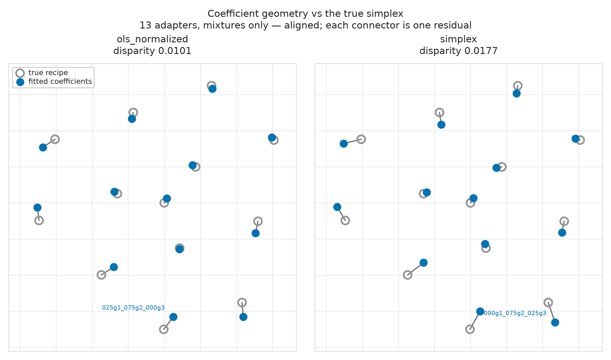

# Coefficient geometry vs the ground-truth simplex

## What this measures

The interpolation fit gives every adapter a set of coefficients — how much of each pure-component adapter it looks like. The data recipe gives every adapter its *true* proportions. Both are points on the same triangle.

`report.md` already asks how far each fitted point is from its own true point, one adapter at a time. This asks a different question: **do the fitted points, all together, form the same arrangement as the true ones?** A set of fits could each be a little off and still lay out the same shape — or each be close while scrambling which adapter neighbours which. Only the second question is comparable to what the other taxonomy levels report.

Two statistics, both against the ideal simplex the recipes define:

- **Procrustes disparity** — slide, rotate and rescale the fitted arrangement to sit on top of the true one as well as it can, then measure what is left over. **0 = identical shape**, 1 = no better than unrelated. This is the number that discriminates.
- **dCor** — distance correlation, computed on the distance matrices with no embedding step at all. **1 = perfect dependence.** Read it as corroboration, not as the headline: see the caveats below.

## The four numbers

| coefficients | Procrustes disparity ↓ | dCor ↑ |
|---|---|---|
| `ols_normalized` | 0.01012 | 0.9858 |
| `simplex` | 0.01769 | 0.9808 |

Measured over **13 adapters** — corner adapters excluded.

## Full results

| coefficients | disparity | disparity (no MDS) | PROTEST p | dCor | dCor p | MDS stress | worst model |
|---|---|---|---|---|---|---|---|
| `ols_normalized` | 0.01012 | 0.01006 | 0.0001 | 0.9858 | 0.0001 | 1.50e-05 | `025g1_075g2_000g3` (0.0433) |
| `simplex` | 0.01769 | 0.01787 | 0.0001 | 0.9808 | 0.0001 | 1.25e-05 | `000g1_075g2_025g3` (0.0583) |

## Figure

**`procrustes_superposition.png`** — the two arrangements laid on top of each other after the best possible alignment. Hollow markers are the true recipes, filled markers the fitted coefficients, and each connector is one adapter's leftover error. Short connectors everywhere means the shape was recovered; one long connector in an otherwise tidy panel means a single adapter is responsible for the disparity, which the summary number alone would hide.

## Reading this

**The fitted coefficients recover the simplex.** `ols_normalized` reaches a disparity of 0.01012 — on a scale where 0 is an identical arrangement and 1 is no relationship — with dCor 0.9858. The geometry the data mixtures define is present in the adapter weights, not just approximately but as very nearly the same shape.

**Rescaling beats constraining, here too.** `simplex` scores 0.01769, 1.7x worse than `ols_normalized`. That agrees with the per-adapter finding in `report.md` — forcing the coefficients to sum to 1 fights the shrinkage γ instead of reporting it, and pushes the surplus onto components that should be zero. The same defect that roughly doubles the per-point error also deforms the arrangement, so the two measurements are telling one story rather than two.

## Caveats

- **The MDS step is close to a no-op here.** With 3 components the coefficient distance matrix is exactly Euclidean in 2 dimensions, so embedding it at `n_components=2` reproduces the arrangement rather than approximating it — the disparity it reports differs from the one computed straight from the coefficients by at most 1.8e-04, at a stress of 1.5e-05. The step is kept because it is what makes these numbers commensurate with the other taxonomy levels, and it begins doing real work at more components or a lower projection dimension. It is not doing any here, and this report should not imply otherwise.
- **dCor is unsigned and saturates.** It measures dependence, not agreement: an arrangement that reproduces the truth exactly backwards scores 1.0, identically to a perfect one. At these sizes it also sits near the top of its range for both estimates, separating them by less than 0.01. Rank by Procrustes; treat dCor as a sanity check that the structure is present at all.
- **The dCor p-value floors at 1/(n_permutations+1) = 1.0e-04**, so `p` at that value means *no permutation did better*, not a precisely estimated tail.

## Provenance

- Coefficient distances: barycentric embedding of the fitted weights, the same construction used for the truth (`src.analysis.ground_truth.simplex_distance_matrix`)
- Embedding: `mds`, n_components=2, random_state=0
- Permutations: 9999
- Simplex vertices: g1, g2, g3

