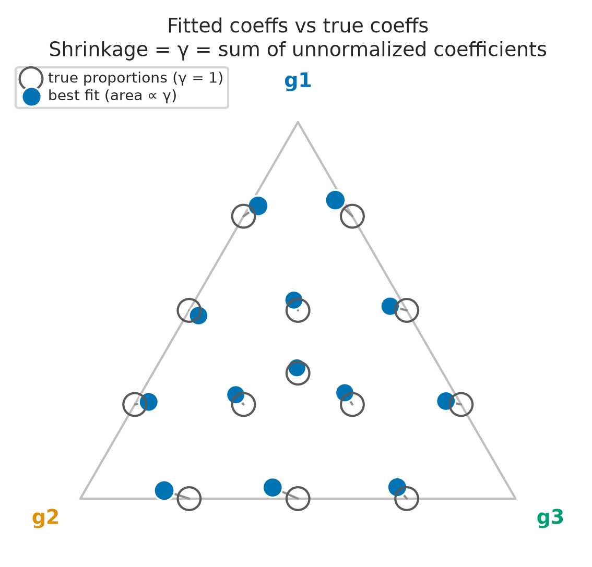
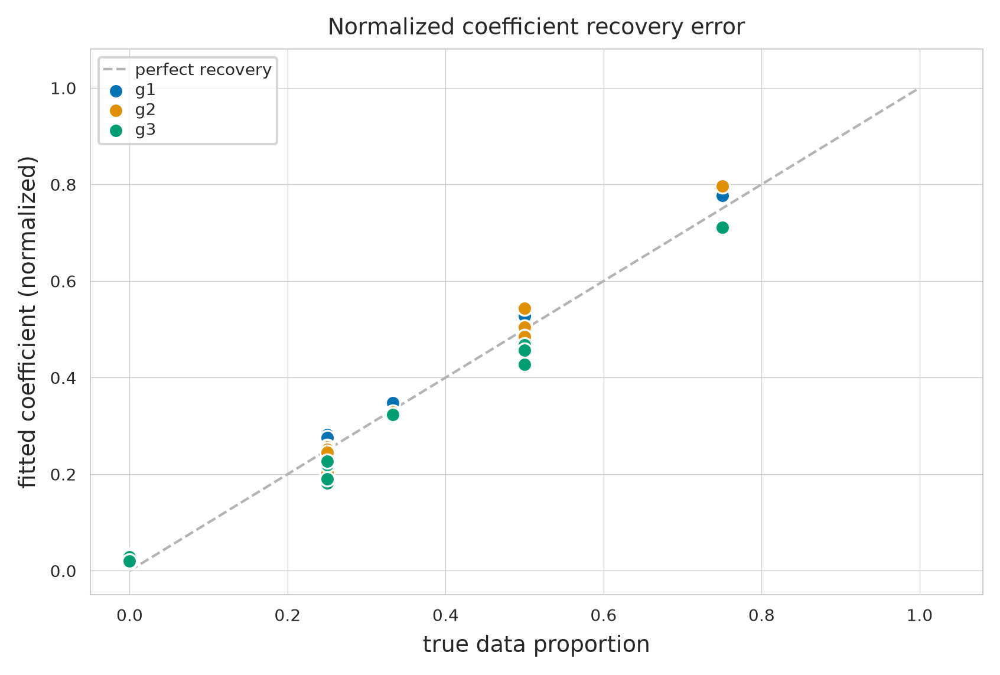
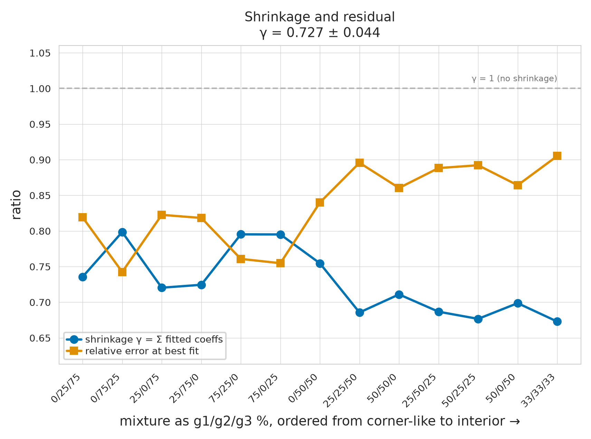
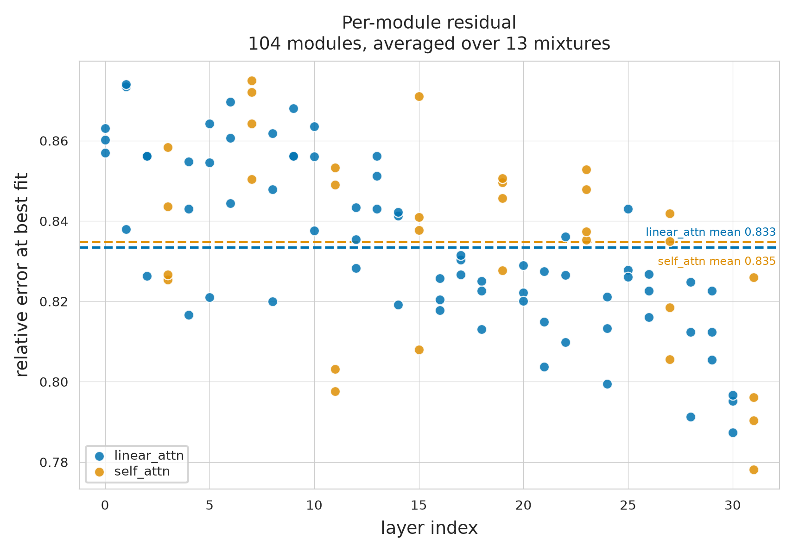

# LoRA corner-interpolation

## What this measures

Some adapters here were trained on a **single** data group (g1, g2, g3). Call these the *corners*. The rest were trained on **blends** of those groups.

Two questions:

1. If you mathematically blend the corner adapters using the same recipe the data used, do you get the adapter that was actually trained on that blend?
2. Working backwards: if you *fit* the best blend of corners to a trained adapter, do the fitted amounts match the real data recipe?

## TLDR

- **No, you can't rebuild the weights.** Even the best possible blend misses most of the adapter — it captures only about **30%** of it. The corner adapters point in nearly unrelated directions, so blends of them cover very little ground. This finding is measured in terms of normalized error, where we take the norm of the linearize difference of LoRAs, and divide by the norm of the blended LoRA. 
- **Yes, you can read the recipe off the weights.** The fitted amounts land very close to the true data proportions, about **10x better than guessing**. The weights don't match, but they still reveal what the model was trained on.
- **Blends consistently come out too strong.** The fitted amounts add up to **0.73**, not 1.00 — see *shrinkage* below.

## Notation/Terms

- **Corner adapter** — trained on one group only (100% / 0% / 0%).
- **Fitted coefficients (w')** — the blend of corners that best matches a trained adapter, found by least squares.
- **Shrinkage (γ)** — *how much corner-material the fitted coefficients asks for in total*: the fitted amounts added together, before rescaling them to sum to 1. If a trained adapter were exactly a proportional blend of the corners, γ would be 1.00. Every value here is below that, averaging **0.73** — meaning a proportional blend of corners consistently *overshoots*, and the real adapter carries only about that fraction of the corner directions. γ measures **size**; the rescaled amounts w'/γ measure **direction**.
- **Normalized coeffs (ŵ)** - Fitted amounts divided by shrinkage
- **Relative error** — how much of the adapter the blend fails to reproduce, as a fraction. 0 is perfect, 1 means the blend is no better than predicting nothing. In short, it is the norm of the difference between the blend and true LoRA, divide by the norm of the true LoRA. 
- **Coefficient error ‖w'−w‖₂** — distance between the fitted recipe and the true data recipe. 0 is perfect.

## Figures

**`ternary.png`** — Each corner of the triangle is one pure data group. A hollow circle is where an adapter's *real* recipe sits; the blue dot joined to it is where the *fitted* recipe sits. Short connectors mean the fit found the right recipe. Dot size is shrinkage γ — dots get smaller toward the middle, so the more evenly a model mixes all three groups, the less it looks like a blend of the pure models.

**`recovered_vs_true.png`** — Fitted amount against true data proportion, one colour per group. Points on the dashed diagonal are perfect recoveries. Everything sits close to it, which is the main positive result.

**`shrinkage_and_error.png`** — Read γ off a real axis here. Blend recipes run from corner-like on the left to evenly-mixed on the right. Blue (γ) drifts down and orange (error) climbs: evenly mixed models are both further from the corner span and harder to fit.

**`block_profile.png`** — Error for each of the 104 adapted modules, by depth in the network. The downward drift means deeper layers behave more like blends than early ones. The two dashed lines show the two attention families are nearly identical, so this is not an artifact of the model's hybrid architecture.

## Per-mixture results

- Base model: `Qwen/Qwen3.5-4B`
- Corner adapters: `100g1_000g2_000g3`, `000g1_100g2_000g3`, `000g1_000g2_100g3`
- Measured over 104 adapted modules, rank 16, alpha 32

Distances are between the **effective updates** the adapters add to the base model, `ΔW = (alpha/r)·B@A`, over every module at once.

| mixture | true w | fitted w' | γ | rel err @ true | rel err @ fit | cos | ‖w'−w‖₂ | ‖w'−w‖₁ | simplex w' | rel err @ simplex |
|---|---|---|---|---|---|---|---|---|---|---|
| `000g1_025g2_075g3` | [0.000 0.250 0.750] | [0.030 0.257 0.713] | 0.736 | 0.8527 | 0.8190 | 0.573 | 0.0485 | 0.0742 | [0.113 0.274 0.612] | 0.8351 |
| `000g1_050g2_050g3` | [0.000 0.500 0.500] | [0.030 0.543 0.427] | 0.755 | 0.8642 | 0.8400 | 0.539 | 0.0899 | 0.1459 | [0.107 0.489 0.404] | 0.8533 |
| `000g1_075g2_025g3` | [0.000 0.750 0.250] | [0.021 0.797 0.182] | 0.799 | 0.7595 | 0.7425 | 0.667 | 0.0853 | 0.1362 | [0.086 0.701 0.212] | 0.7527 |
| `025g1_000g2_075g3` | [0.250 0.000 0.750] | [0.259 0.030 0.711] | 0.720 | 0.8609 | 0.8226 | 0.568 | 0.0506 | 0.0789 | [0.283 0.112 0.605] | 0.8411 |
| `025g1_025g2_050g3` | [0.250 0.250 0.500] | [0.281 0.252 0.467] | 0.686 | 0.9218 | 0.8957 | 0.444 | 0.0454 | 0.0658 | [0.301 0.274 0.425] | 0.9172 |
| `025g1_050g2_025g3` | [0.250 0.500 0.250] | [0.276 0.505 0.219] | 0.687 | 0.9126 | 0.8883 | 0.459 | 0.0405 | 0.0616 | [0.297 0.448 0.255] | 0.9100 |
| `025g1_075g2_000g3` | [0.250 0.750 0.000] | [0.257 0.715 0.029] | 0.724 | 0.8553 | 0.8183 | 0.574 | 0.0459 | 0.0706 | [0.281 0.607 0.112] | 0.8360 |
| `033g1_033g2_033g3` | [0.333 0.333 0.333] | [0.347 0.329 0.324] | 0.673 | 0.9286 | 0.9051 | 0.425 | 0.0176 | 0.0282 | [0.346 0.327 0.327] | 0.9284 |
| `050g1_000g2_050g3` | [0.500 0.000 0.500] | [0.511 0.033 0.456] | 0.699 | 0.8971 | 0.8642 | 0.502 | 0.0557 | 0.0874 | [0.461 0.120 0.419] | 0.8846 |
| `050g1_025g2_025g3` | [0.500 0.250 0.250] | [0.527 0.246 0.227] | 0.677 | 0.9160 | 0.8922 | 0.451 | 0.0359 | 0.0545 | [0.468 0.271 0.261] | 0.9152 |
| `050g1_050g2_000g3` | [0.500 0.500 0.000] | [0.486 0.485 0.029] | 0.711 | 0.8896 | 0.8604 | 0.509 | 0.0350 | 0.0572 | [0.445 0.438 0.116] | 0.8788 |
| `075g1_000g2_025g3` | [0.750 0.000 0.250] | [0.793 0.018 0.189] | 0.795 | 0.7716 | 0.7548 | 0.654 | 0.0762 | 0.1210 | [0.701 0.080 0.219] | 0.7654 |
| `075g1_025g2_000g3` | [0.750 0.250 0.000] | [0.777 0.203 0.020] | 0.795 | 0.7782 | 0.7608 | 0.647 | 0.0581 | 0.0944 | [0.689 0.227 0.084] | 0.7714 |

## Summary

- Shrinkage **γ = 0.7274 ± 0.0440** over 13 mixtures
- Relative error at the true recipe: **0.8622**; at the best fit: **0.8357** (so the corner blend captures 30.2% of the adapter)
- Coefficient error ‖w'−w‖₂: **0.0527** (rescaled fit) vs 0.1169 (forced to sum to 1)
- Guessing at random would score 0.5331, so the fit is **10.1x better than chance**
- Corner adapters are nearly unrelated to each other: mean cosine 0.071 (1.0 = identical, 0 = unrelated)

## Reading this

Three things are true at once, and they are easy to mistake for a contradiction.

**The corner adapters cover too little ground.** Blending them reproduces only about 30% of a trained mixture adapter, even using the best possible amounts. The reason is in the corner adapters themselves: they point in nearly unrelated directions (mean cosine 0.071), so blends of them reach only a narrow slice of the space an adapter can occupy. Independently trained LoRAs simply land in different places.

**But the amounts still tell you the recipe.** The fitted amounts come out 10.1x closer to the true data proportions than guessing would (0.053 against 0.533). So while you cannot rebuild the weights, you can read off what the model was trained on.

**Blends consistently come out too strong.** The fitted amounts sum to γ = 0.727 ± 0.044 instead of 1, and how tight that spread is matters more than the value: every single mixture carries about 27% less corner-material than a proportional blend would give it. That is why the rescaled fit is the headline number — forcing the amounts to sum to 1 fights this effect and dumps the excess onto groups that should be zero, worsening the recipe error from 0.053 to 0.117.

One caveat worth stating: a relative error of 0.84 sounds like a failure, but two adapters that were *separately trained* on neighbouring recipes are about as far apart from each other. Much of this gap is ordinary training-run variation, not something interpolation introduces. Confirming that needs the same recipe trained twice under different seeds, which this adapter set does not have.

## Corner self-consistency

A corner adapter fitted against the corner basis must come back as itself, with no error. This is a check on the whole pipeline.

| corner | fit | residual |
|---|---|---|
| `000g1_000g2_100g3` | [0.000 0.000 1.000] | 0.000e+00 |
| `000g1_100g2_000g3` | [0.000 1.000 -0.000] | 0.000e+00 |
| `100g1_000g2_000g3` | [1.000 -0.000 0.000] | 0.000e+00 |
